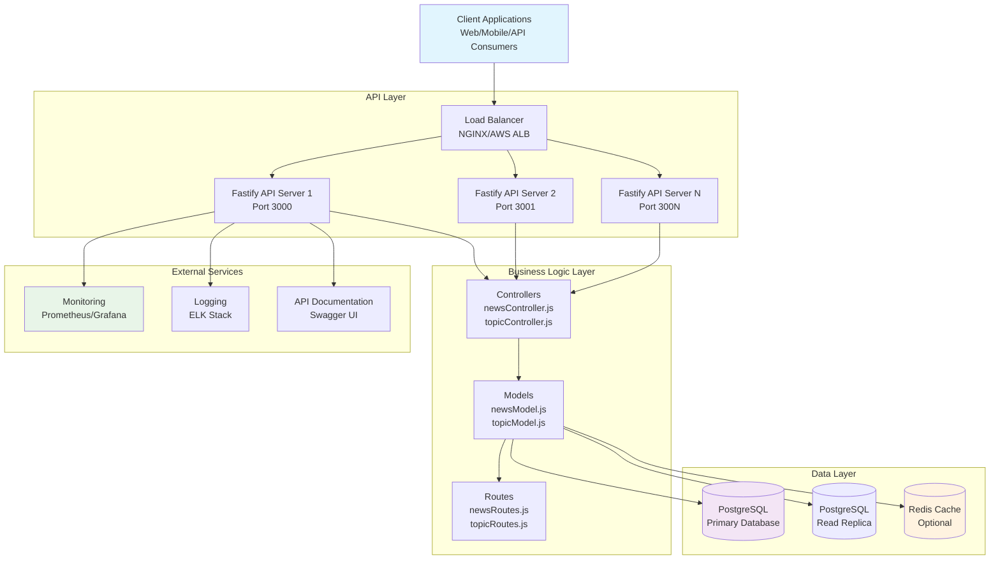
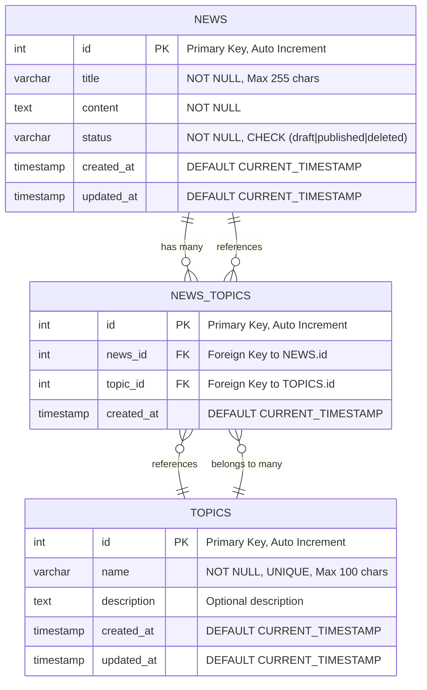
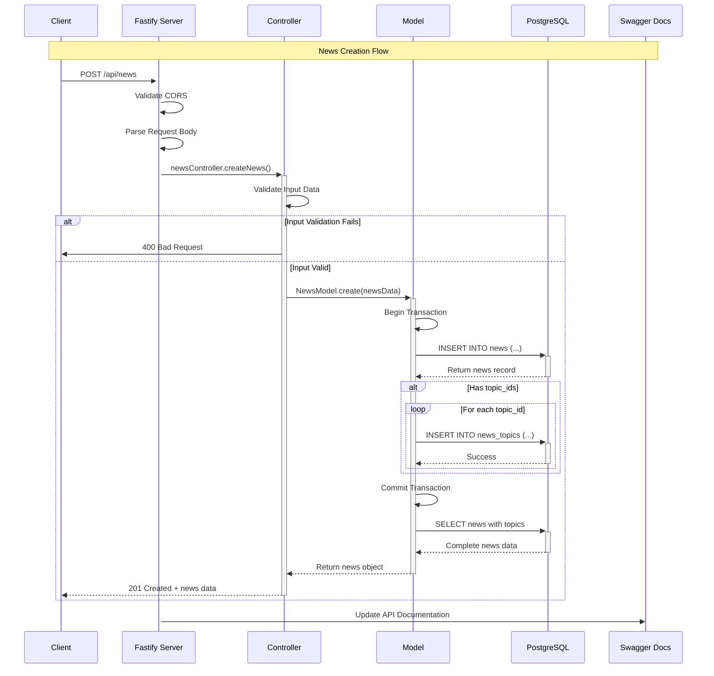
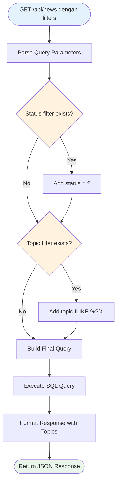
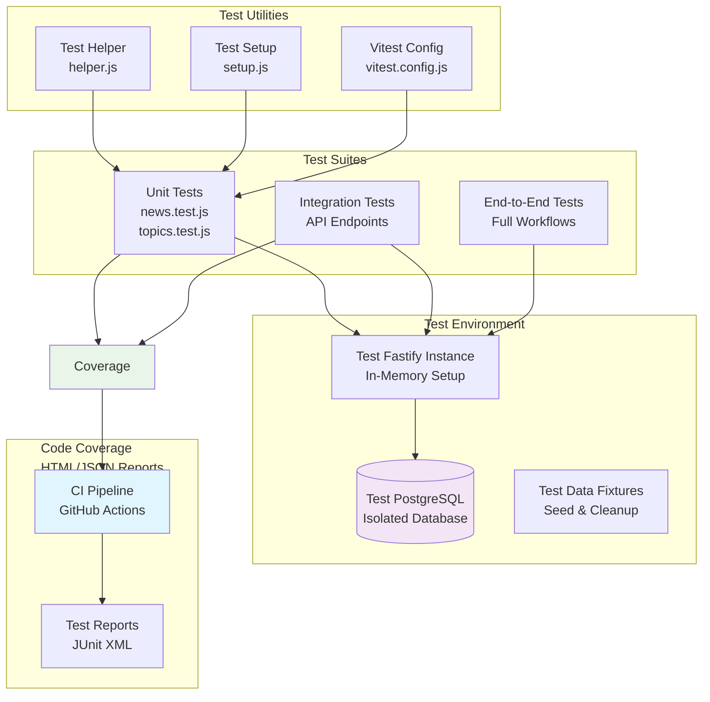
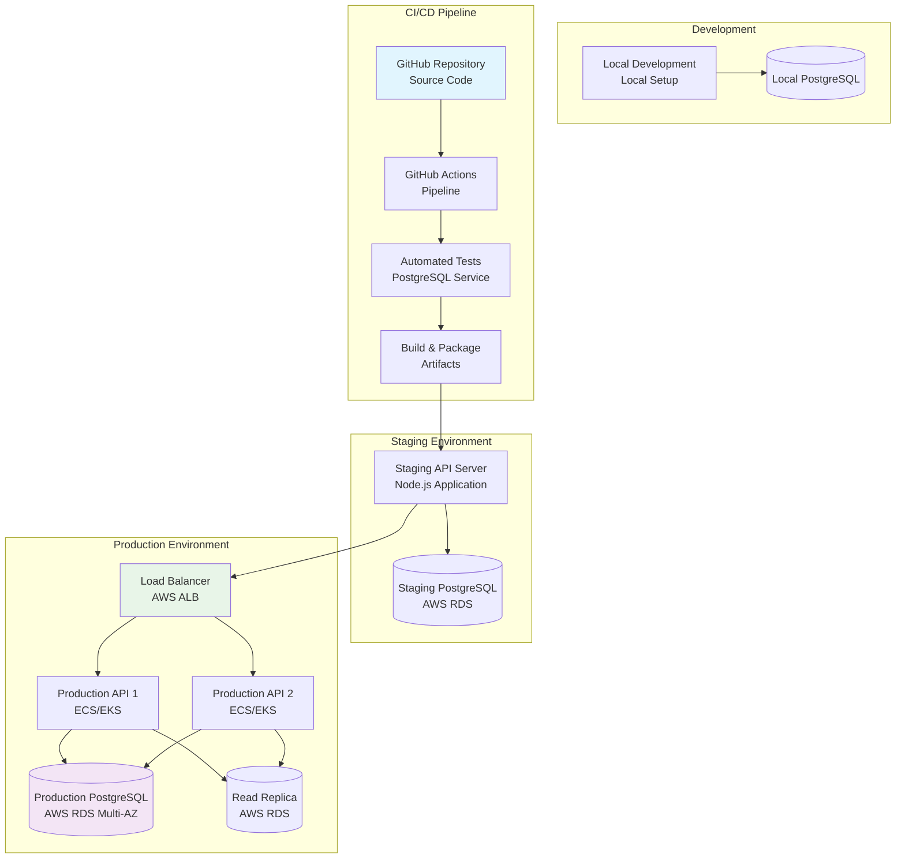
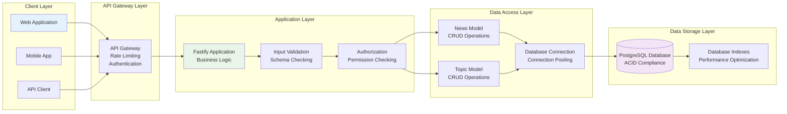
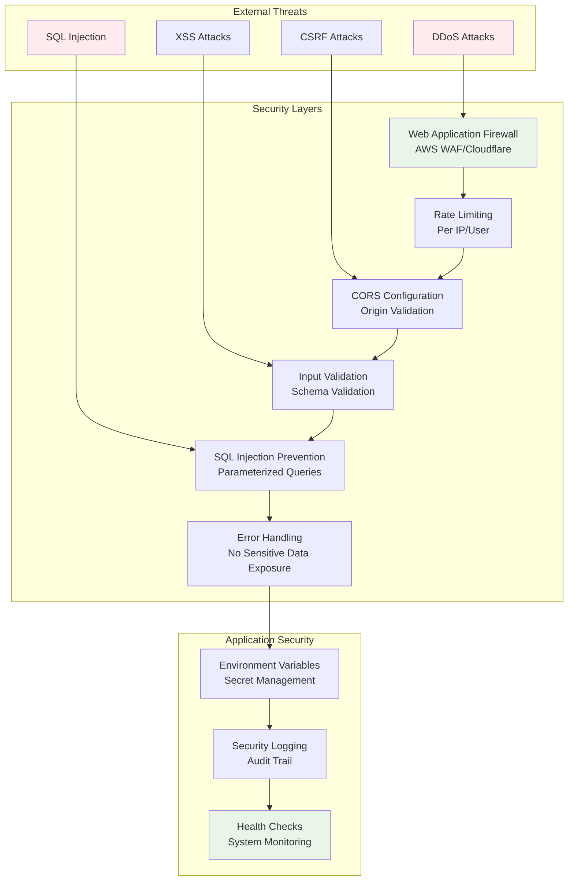
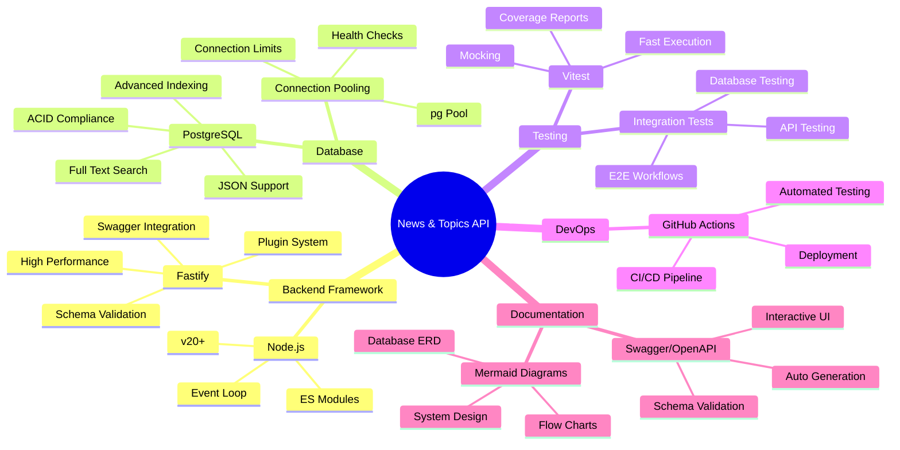

# System Design Documentation

Dokumentasi desain sistem untuk **News & Topics Management API** menggunakan diagram Mermaid untuk visualisasi arsitektur, database, dan flow aplikasi.

## 🏗️ High-Level Architecture

## 🗂️ Database Entity Relationship Diagram

## 🔄 API Request Flow

## 🔍 News Filtering Flow

## 🧪 Testing Architecture

## 🚀 Deployment Architecture

## 📊 Data Flow Diagram

## 🔐 Security Architecture

## 🔧 Technology Stack Diagram

---

**System Design ini menggunakan pattern dan best practices modern untuk memastikan scalability, maintainability, dan performance yang optimal.**
